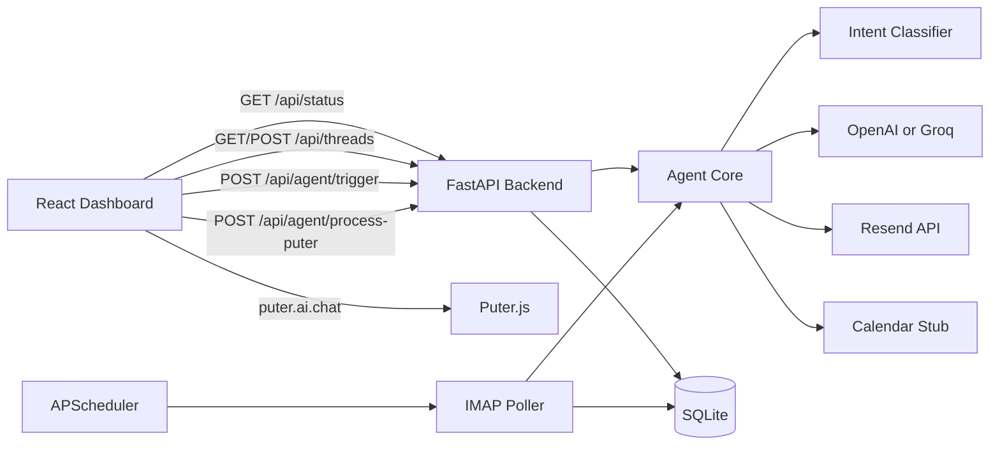

# Email Wake-Up Agent

Email Wake-Up Agent is a production-ready outreach workflow for cold emailing prospects, handling budget negotiation, and booking calls with full thread memory. It includes a FastAPI backend, a React dashboard, IMAP polling, Resend outbound delivery, and a Puter.js browser fallback when no server-side LLM key is configured.

## Architecture diagram

## Tech stack table

| Layer | Choice |
| --- | --- |
| Backend | Python 3.11 + FastAPI |
| Database | SQLite + SQLAlchemy async |
| Email outbound | Resend API |
| Email inbound | IMAP polling with `imaplib` |
| LLM fallback chain | OpenAI GPT-4o → Groq llama-3.3-70b-versatile → Puter.js |
| Scheduler | APScheduler |
| Calendar | Cal.com-style stub |
| Frontend | React + Vite + Tailwind CSS |
| Containers | Docker Compose + nginx |

## Setup & run

### Docker path

1. Copy `backend/config.example.env` to `backend/.env`.
2. Fill in at least your email credentials and one LLM option, or leave both LLM keys blank for Puter mode.
3. Run `docker compose up --build`.
4. Open `http://localhost:8080` for the dashboard.
5. The API stays available at `http://localhost:8000`.

### Manual backend + frontend path

1. Copy `backend/config.example.env` to `backend/.env`.
2. In `backend/`, create a virtual environment and install `requirements.txt`.
3. Run `alembic upgrade head` from `backend/`.
4. Start the API with `uvicorn app.main:app --reload --host 0.0.0.0 --port 8000`.
5. In `frontend/`, run `npm install` and then `npm run dev`.

### LLM modes

- OpenAI mode: set `OPENAI_API_KEY`.
- Groq mode: leave `OPENAI_API_KEY` blank and set `GROQ_API_KEY`.
- Puter mode: leave both keys blank. The dashboard will show `llm_available: false`, load Puter.js in the browser, and send the resulting tool call to `/api/agent/process-puter`.

## How to trigger the reschedule loop demo

1. Create a thread from the dashboard and trigger the first outreach.
2. Reply as the prospect until the agent proposes slots and books one.
3. Send a cancellation-style inbound reply like “Need to reschedule that hold. Could we move it?”
4. Accept the newly proposed slot.
5. Repeat the cancellation and acceptance cycle five times to mirror `backend/tests/test_reschedule_loop.py`.

## Sample transcript references

- `samples/successful_booking.json`
- `samples/reschedule_loop.json`
- `samples/graceful_walkaway.json`

## Trade-offs & known limitations

- IMAP polling is intentionally simple and runs in-process, which keeps setup light but is not horizontally scalable.
- The calendar integration is a stub that writes bookings locally instead of creating real external events.
- The Puter.js fallback keeps the product free-to-run without API keys, but it moves LLM reasoning into the browser.
- SQLite is ideal for demos and small deployments, but a multi-user production rollout would want Postgres.
- Python 3.14 emits third-party deprecation warnings in the local test environment even though the app targets Python 3.11.

## Swapping the calendar stub

Replace `backend/app/calendar/stub.py` with a real Cal.com adapter that keeps the same high-level responsibilities:

1. `get_available_slots(count)` should call Cal.com availability endpoints.
2. `book_slot(thread_id, slot)` should create the real event and persist the returned event id.
3. `cancel_slot(event_id)` or the reschedule path should cancel or move the external booking and mirror that state in the `bookings` table.

The rest of the agent loop can stay the same as long as the adapter returns ISO slot strings and stable event ids.
